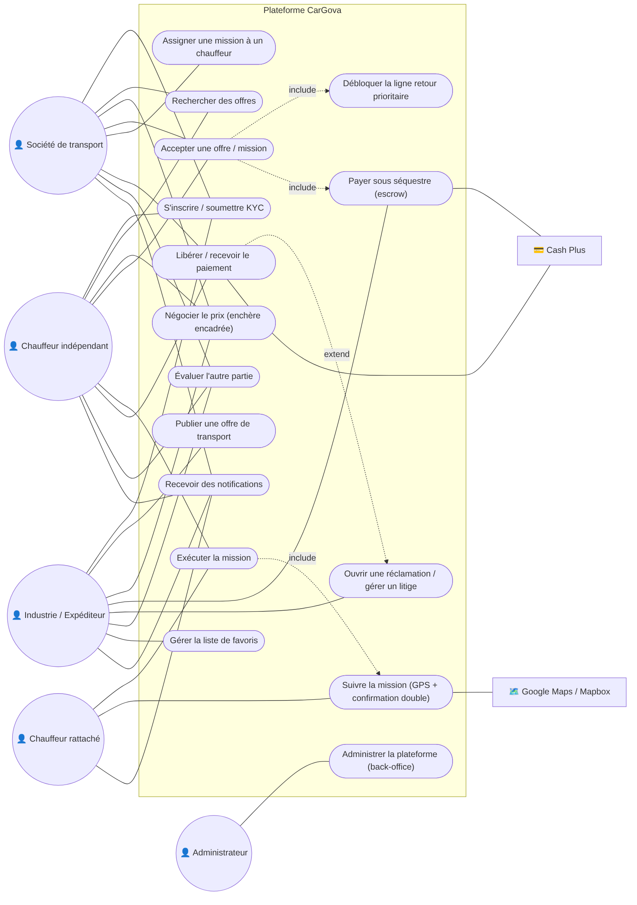
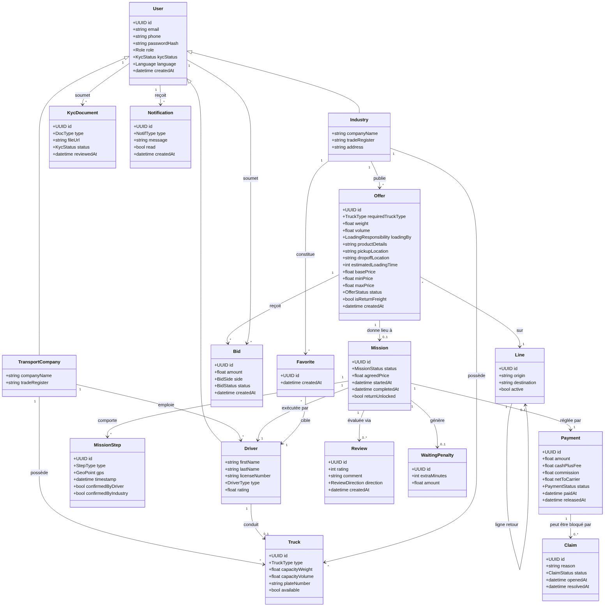
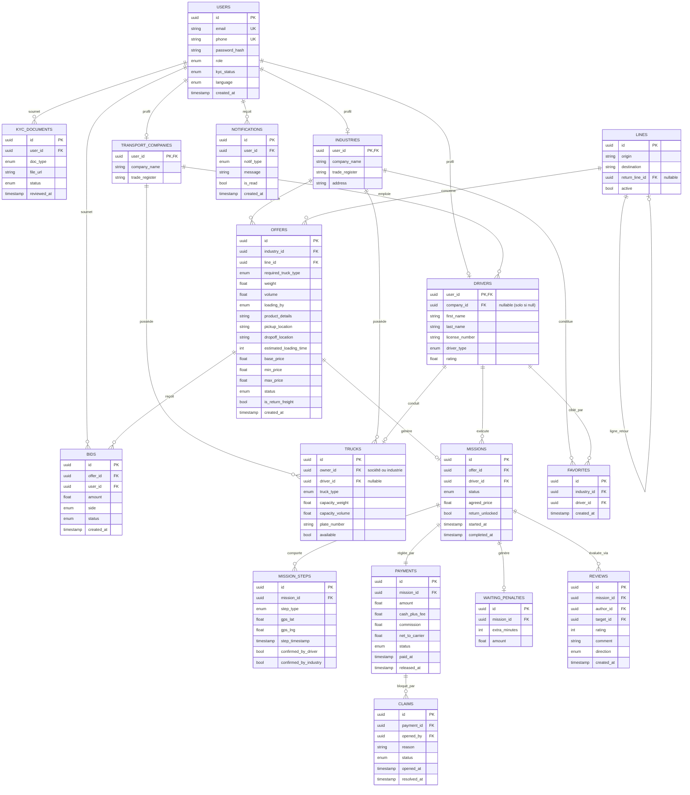

# Diagrammes CarGova (images)

Versions **image (PNG)** des diagrammes définis en Mermaid dans [`../docs`](../docs).
Générées avec `@mermaid-js/mermaid-cli`. Voir les sources Mermaid pour toute modification, puis
régénérer les images.

## Diagramme de cas d'utilisation
Source : [`../docs/02-diagramme-cas-utilisation.md`](../docs/02-diagramme-cas-utilisation.md)



## Diagramme de classes
Source : [`../docs/03-diagramme-classes.md`](../docs/03-diagramme-classes.md)



## Diagramme de base de données (entité-association)
Source : [`../docs/04-diagramme-base-de-donnees.md`](../docs/04-diagramme-base-de-donnees.md)



## Régénérer les images

```bash
npx -y @mermaid-js/mermaid-cli -i <fichier.mmd> -o <image.png> -b white -s 2
```
