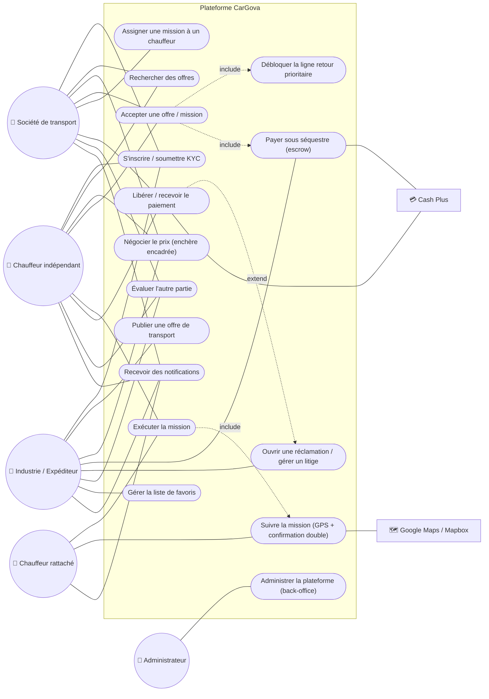

# 02 — Diagramme de cas d'utilisation (Use Case)

Vue des interactions entre les acteurs et les grandes fonctionnalités de CarGova.

## Description des cas d'utilisation

| Cas | Acteur(s) | Résumé |
|-----|-----------|--------|
| S'inscrire / KYC | Tous | Création de compte + soumission des documents ; activation après validation |
| Publier une offre | Industrie | Type de camion, poids/volume, chargement, prise en charge & livraison |
| Rechercher des offres | Chauffeur solo, Société | Consulter les offres disponibles sur les lignes couvertes |
| Négocier le prix | Industrie, Chauffeur, Société | Enchère encadrée (plancher / plafond) |
| Accepter une offre | Chauffeur solo, Société | Déclenche le déblocage prioritaire du retour + le paiement escrow |
| Déblocage ligne retour | Système (déclenché par acceptation) | Accès prioritaire à la ligne retour |
| Assigner une mission | Société | Attribuer la mission à un chauffeur rattaché |
| Exécuter la mission | Chauffeurs | Réaliser le transport |
| Suivre la mission | Chauffeur + Industrie | Étapes GPS horodatées + confirmation croisée |
| Payer (escrow) | Industrie | Paiement séquestré via Cash Plus |
| Libérer / recevoir paiement | Système, Transporteur | Reversement du net après confirmation |
| Réclamation / litige | Industrie, Admin | Suspend le paiement jusqu'à résolution |
| Évaluer | Industrie, Chauffeur, Société | Notation à double sens |
| Gérer favoris | Industrie | Liste de chauffeurs de confiance |
| Notifications | Tous | Push sur événements critiques |
| Administrer | Administrateur | Gestion globale via back-office |
