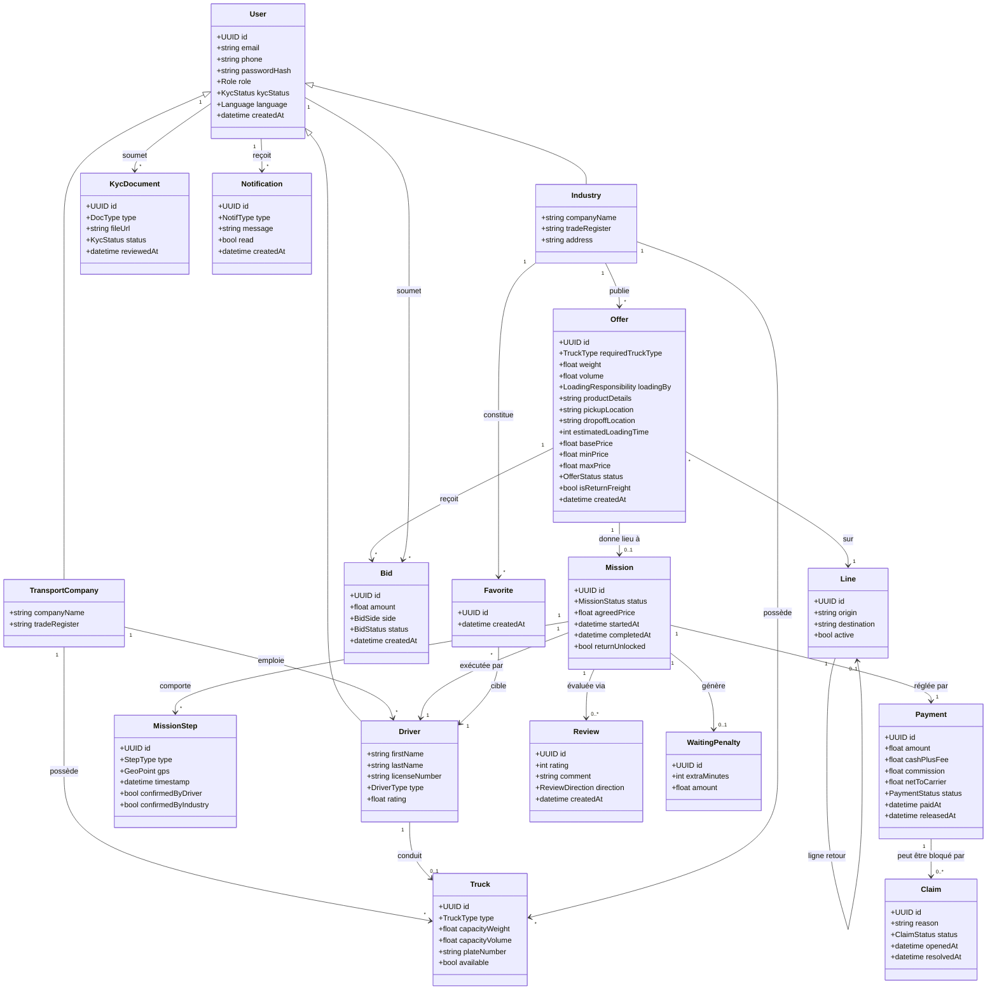

# 03 — Diagramme de classes (modèle du domaine)

Modèle objet simplifié du domaine CarGova (backend FastAPI).

## Énumérations principales

| Enum | Valeurs |
|------|---------|
| `Role` | INDUSTRY, TRANSPORT_COMPANY, DRIVER, ADMIN |
| `DriverType` | SOLO, ATTACHED |
| `KycStatus` | PENDING, APPROVED, REJECTED |
| `DocType` | DRIVING_LICENSE, INSURANCE, TRUCK_STATE, TRADE_REGISTER |
| `TruckType` | SEMI_TRAILER, REFRIGERATED, FLATBED, SMALL_VAN, ... |
| `LoadingResponsibility` | INDUSTRY, DRIVER |
| `OfferStatus` | DRAFT, PUBLISHED, NEGOTIATING, ACCEPTED, CANCELLED |
| `BidSide` | INDUSTRY_DOWN, DRIVER_UP |
| `BidStatus` | PENDING, ACCEPTED, REJECTED |
| `MissionStatus` | CREATED, STARTED, AT_PICKUP, LOADED, IN_TRANSIT, AT_DROPOFF, DELIVERED, CLOSED |
| `StepType` | START, PICKUP_ARRIVAL, LOADING_CONFIRMED, IN_TRANSIT, DESTINATION_ARRIVAL, DROPOFF_DECLARED, DROPOFF_CONFIRMED |
| `PaymentStatus` | ESCROWED, RELEASED, REFUNDED, ON_HOLD |
| `ClaimStatus` | OPEN, RESOLVED, REJECTED |
| `ReviewDirection` | INDUSTRY_TO_DRIVER, DRIVER_TO_INDUSTRY |
| `NotifType` | RETURN_OPPORTUNITY, TRUCK_ARRIVAL, LOADING_DELAY, PAYMENT, CLAIM, ... |
| `Language` | AR, FR, EN |
