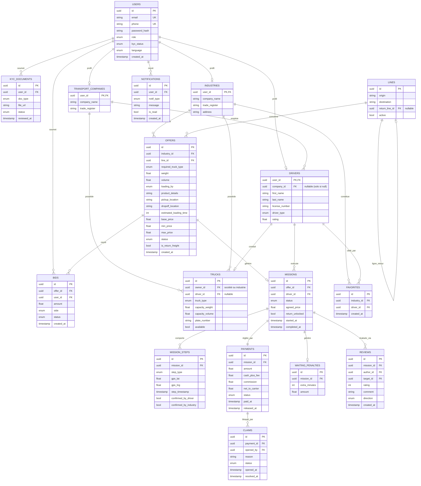

# 04 — Diagramme de base de données (Entité-Association)

Modèle relationnel proposé pour **PostgreSQL** (données transactionnelles & utilisateurs).
Le suivi temps réel des positions chauffeurs s'appuie sur **Redis** (hors schéma relationnel ci-dessous).

## Notes de conception

- **Héritage `USERS` → profils** : un compte `USERS` central porte l'authentification, le rôle, le
  statut KYC et la langue ; les tables `INDUSTRIES`, `TRANSPORT_COMPANIES`, `DRIVERS` en héritent via
  une clé primaire partagée (`user_id`).
- **Ligne retour** : `LINES.return_line_id` référence la ligne inverse ; c'est ce lien qui permet le
  **déblocage prioritaire** du fret retour à l'acceptation d'un aller.
- **Escrow** : `PAYMENTS.status` passe par `ESCROWED → RELEASED` (ou `ON_HOLD` si une `CLAIMS` est
  ouverte, puis `REFUNDED` le cas échéant).
- **Suivi temps réel** : les positions GPS instantanées des chauffeurs vivent dans **Redis** ; seules
  les étapes horodatées et confirmées sont persistées dans `MISSION_STEPS`.
- **Notation double sens** : `REVIEWS.direction` distingue industrie→chauffeur et chauffeur→industrie.
